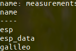
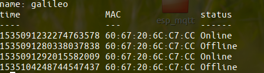
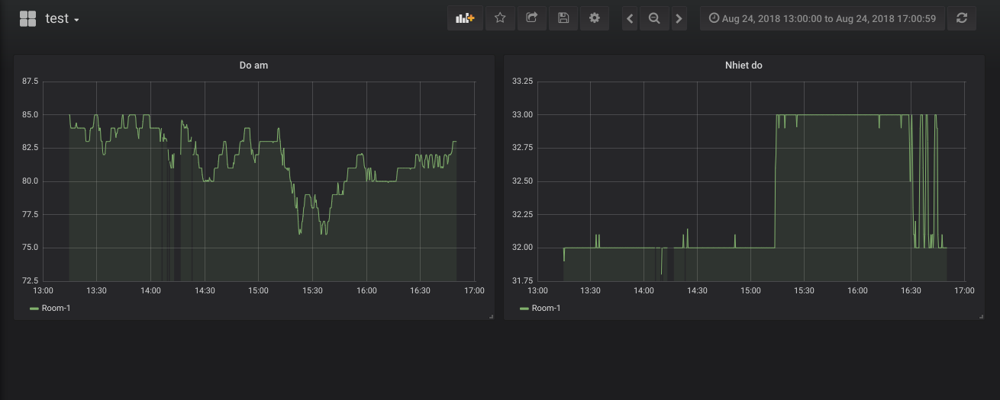

## Định dạng thông điệp

Thông điệp chứa thông tin về esp:

```
{
        "status": "2",
        "MAC": "DC:4F:22:18:DB:F3",
        "data": [
          {
            "unit": "C",
            "temp": "31.00"
          },
          {
            "humi": "91.00",
            "unit": "%"
          }
}
```

- status = 1 : esp kết nối mới tới gateway

- status = 2: chỉ có status=2 thì thông điệp mới chứa phần data

- status = 3: esp mất kết nối tới gateway(will message)

- status = 4: yêu cầu tính nhiệt độ trung bình trong 30p gần đây, server tính truyền về gateway để phát cho esp tại topic :/esp/LED/<esp_MAC> với 1 là đèn xanh, 2 là vàng, 3 là đỏ. 

Thông điệp galileo gửi lên server:

```
{
    "status": "2",
    "payload": [
      {
        "status": "2",
        "MAC": "DC:4F:22:18:DB:F3",
        "data": [
          {
            "unit": "C",
            "temp": "31.00"
          },
          {
            "humi": "91.00",
            "unit": "%"
          }
        ]
      }
}
```

- status = 1: galileo mở kết nối mới tới server

- status = 2: thông điệp chứa dữ liệu thông thường, phần payload là mảng các dữ liệu nhận được từ esp.

- status = 3: galileo mất kết nối

### Cơ sở dữ liệu

3 bảng :



bảng esp: thông tin về esp


bảng galileo: thông tin về galileo:



bảng esp_data: dữ liệu về nhiệt độ, độ ẩm


### Đồ thị 




